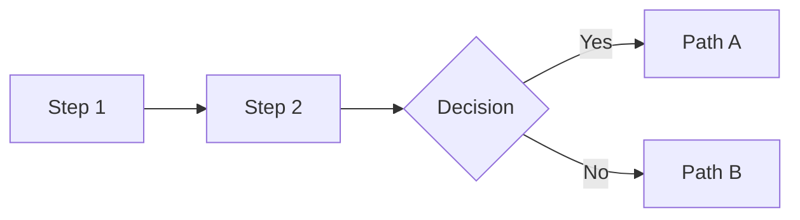

# PR Description Writer Skill

## When to Use This Skill

Use this Skill when:

- Creating or updating a PR description for a feature branch.
- The PR has multiple related changes that need clear organization.
- You want a description that helps reviewers understand the "why" and "what"
  quickly while having access to detailed context.
- You're preparing a PR for review and want it to be self-documenting.

This Skill is designed to work with any repository but is especially tuned for
Django/Python backends, React frontends, and infrastructure changes.

## Example Prompts

- "Use `pr-description-writer` to create a PR description for my current branch."
- "Generate a comprehensive PR description for PR #1234 using the
  `pr-description-writer` Skill."
- "Update the PR description for my feature branch to match our standard format."

---

## Workflow (High Level)

1. Gather PR and branch context (see [references/gh-cli.md](references/gh-cli.md) for exact commands).
2. Identify the base branch and enumerate **all** changes (committed + uncommitted).
3. Write a layered, reviewer-centric PR description using the structure below.
4. If the user wants, update/create the PR using `gh` (see [references/gh-cli.md](references/gh-cli.md)).

---

## Core Principles

### 1. Scannable First, Detailed Second

Reviewers should understand the PR in 30 seconds from the summary, then dive
deeper as needed. Structure content in layers:

1. **Summary table** – Quick overview of key features (30 seconds)
2. **Visual diagrams** – Understand flows without reading code (1-2 minutes)
3. **Detailed sections** – Full context for each feature (as needed)
4. **Collapsible file lists** – Reference without clutter

### 2. Visual Over Verbal

Use diagrams, tables, and structured formatting instead of prose where possible:

- Decision trees for conditional logic
- Flow diagrams for pipelines and processes
- Tables for feature summaries and comparisons
- Code blocks for commands and examples

### 3. Reviewer-Centric

Every section should answer a reviewer's question:

- "What does this PR do?" → Summary
- "Why was it done this way?" → Detailed sections with rationale
- "What files should I focus on?" → Collapsible file lists
- "How do I test this?" → Test commands + manual steps
- "Are there breaking changes?" → Explicit callouts

### 4. Complete Picture

**Never describe only the latest commit.** The PR description must reflect:

- All commits in the branch (from base to HEAD)
- Any uncommitted changes the user plans to include
- The cumulative effect of all changes together

---

## PR Description Structure

### Section 1: Summary

Start with a 1-2 sentence high-level summary, then provide a **Key Features
table** if the PR has 3+ distinct features:

```markdown
## Summary

This PR adds [brief description of the main change].

### Key Features

| Feature | Description |
|---------|-------------|
| **Feature A** | Short description of what it does |
| **Feature B** | Short description of what it does |
| **Feature C** | Short description of what it does |
```

For smaller PRs (1-2 features), a bullet list is acceptable.

### Section 2: Visual Diagrams

For any non-trivial flow, include a visual diagram. Choose the appropriate
format based on complexity:

#### ASCII Art (Simple Flows)

Use for decision trees and linear flows:

````markdown
## Feature Flow

```
First condition?
     │
    YES ──► Has prior state? ──► YES: Action A
     │                       └──► NO:  Action B
     │
    NO ───► Action C
```
````

#### Mermaid (Complex Flows)

Use for multi-step pipelines, state machines, or architectures:

````markdown
## Architecture


````

#### Box Diagrams (Pipelines)

Use for showing data flow or process stages:

````markdown
## Data Pipeline

```
┌─────────────────┐     ┌─────────────────┐     ┌─────────────────┐
│   Input Stage   │────►│  Process Stage  │────►│  Output Stage   │
│  (description)  │     │  (description)  │     │  (description)  │
└─────────────────┘     └─────────────────┘     └─────────────────┘
```
````

### Section 3: Detailed Feature Sections

For each major feature, provide a dedicated section with:

- **What it does** – Behavior description
- **Why this approach** – Rationale for key decisions
- **Key implementation details** – Important patterns or constraints

Use horizontal rules (`---`) to separate major features.

```markdown
---

## Feature A: Title

Description of what this feature does and why.

Key implementation details:
- Point 1
- Point 2

---

## Feature B: Title

...
```

### Section 4: Files Changed

Group files by category using collapsible sections:

```markdown
## Files Changed

<details>
<summary>Core modules (click to expand)</summary>

- `path/to/file1.py` - Brief description
- `path/to/file2.py` - Brief description

</details>

<details>
<summary>Tests (click to expand)</summary>

- `tests/test_file1.py` - What it tests
- `tests/test_file2.py` - What it tests

</details>
```

Categories to consider:
- Core modules / Services
- API / Views / Routes
- Models / Migrations
- Tests
- Configuration / Settings
- Documentation

### Section 5: How to Test

Provide both automated and manual testing instructions:

````markdown
## How to Test

```bash
# Run all related tests
.bin/pytest path/to/tests/ -v
```

### Manual Testing

1. **Test scenario A**: Step-by-step instructions
2. **Test scenario B**: Step-by-step instructions
````

### Section 6: Breaking Changes / Notes

Always include a section for special considerations:

```markdown
## Notes

- **No Migrations**: This PR has no schema changes.
```

Or for PRs with important notes:

```markdown
## Breaking Changes

- **API Change**: The `/api/endpoint` now returns X instead of Y.
- **Config Required**: Set `NEW_ENV_VAR` before deploying.

## Deploy Steps

1. Add environment variable `NEW_VAR=value`
2. Run migrations
3. Deploy code
```

---

## When to Use Each Element

| Scenario | Use |
|----------|-----|
| 3+ distinct features | Summary table |
| Conditional logic | ASCII decision tree |
| Multi-step process | Box diagram or Mermaid |
| 5+ files in a category | Collapsible details |
| Test commands exist | Code block with commands |
| Manual testing needed | Numbered step list |
| Schema changes | Explicit migration section |
| Breaking changes | Dedicated callout section |

---

## Common Patterns

### Feature Flag Pattern

```markdown
## Feature Flag

Controlled by `FEATURE_FLAG_NAME` (default: `False`).

When enabled:
- Behavior A
- Behavior B

When disabled:
- Falls back to original behavior
```

### Migration Pattern

```markdown
## Migrations

| Migration | Description | Reversible |
|-----------|-------------|------------|
| `0001_add_field.py` | Adds `new_field` to Model | Yes |
| `0002_backfill.py` | Backfills existing rows | Yes (data loss) |

### Rollback Plan

1. Revert code deployment
2. Run `./manage.py migrate app_name 0000_previous`
```

### API Change Pattern

```markdown
## API Changes

### New Endpoints

| Method | Path | Description |
|--------|------|-------------|
| `GET` | `/api/v2/resource` | Fetches resource with new format |

### Modified Endpoints

| Endpoint | Change |
|----------|--------|
| `GET /api/v1/old` | Now returns `new_field` in response |

### Deprecated

- `GET /api/v1/legacy` - Use `/api/v2/resource` instead
```

---

## Anti-Patterns to Avoid

1. **Wall of text** – Use formatting (tables, lists, diagrams) instead of
   paragraphs.

2. **Vague descriptions** – "Various bug fixes" tells reviewers nothing.
   Be specific.

3. **Missing test instructions** – Always include how to verify the changes.

4. **Buried breaking changes** – Put them in a dedicated, visible section.

5. **Listing every file** – Use collapsible sections and group by purpose.

6. **No visual aids for flows** – If you need more than 2 sentences to explain
   a flow, use a diagram.

7. **Describing only the latest commit** – The PR description should cover ALL
   commits and changes in the branch.

---

## References

- GitHub context-gathering commands (`gh` + `git`): [references/gh-cli.md](references/gh-cli.md)

## Output

When this Skill generates a PR description, it should:

1. **Gather all context first** using the commands above.
2. **Analyze ALL changes** – not just the latest commit.
3. **Output the full markdown** for the PR description.
4. **Offer to update the PR** directly using `gh pr edit` if a PR exists, or
   create one using `gh pr create` if not.
5. **Be ready to iterate** based on user feedback.

The description should be copy-paste ready for GitHub.

## Compatibility Notes

This Skill is designed to work with both Claude Code and OpenAI Codex.

- Claude Code: install the corresponding plugin and use its slash commands (see `plugins/pr-description-writer/commands/`).
- Codex: install the Skill directory and invoke `name: pr-description-writer`.

For installation, see this repo's `README.md`.
